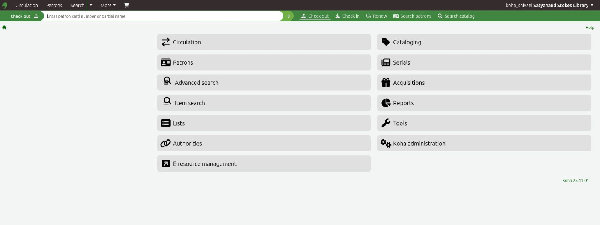
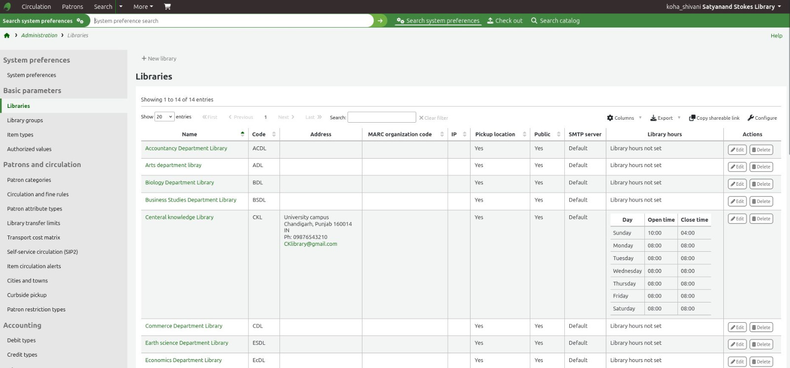
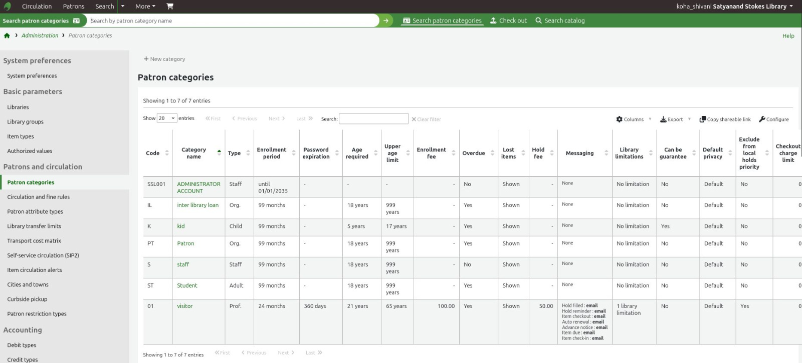
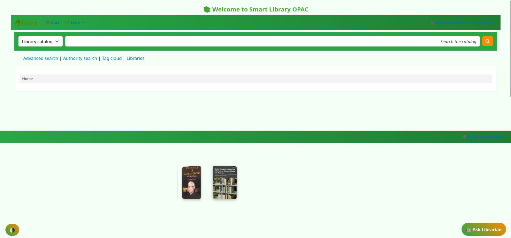
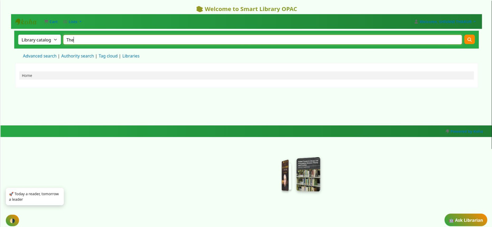
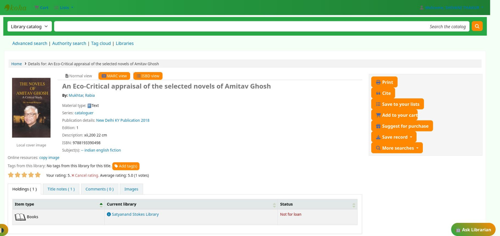
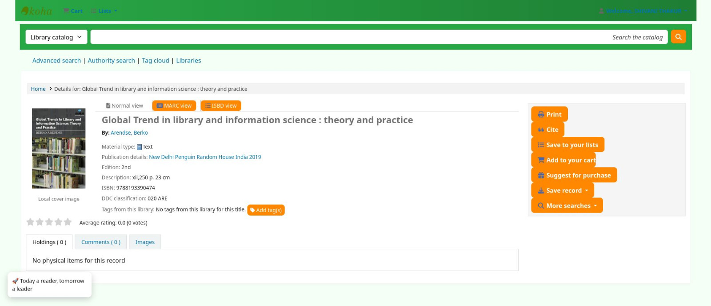

# koha-library-management-project
A practical Koha Library Management System project based on hands-on practice with Koha installation, library configuration, patron management, budgeting, cataloguing, and OPAC customization.
## Project Overview

This project demonstrates practical work with the Koha Integrated Library Management System (ILMS). The project covers basic library setup, patron management, budgeting, cataloguing, and OPAC customization.

## Features Practiced

- Koha installation and basic setup
- Library configuration
- Patron management
- Budget management
- Cataloguing and book records
- OPAC book search and search results
- OPAC interface customization

## Screenshots

### Koha Login Page

### Koha Staff Interface

### Koha Library Configuration

### Koha Patron Management
 

### OPAC Customization

### OPAC Book Search

### OPAC Search Results

### OPAC Search Results – Additional View

